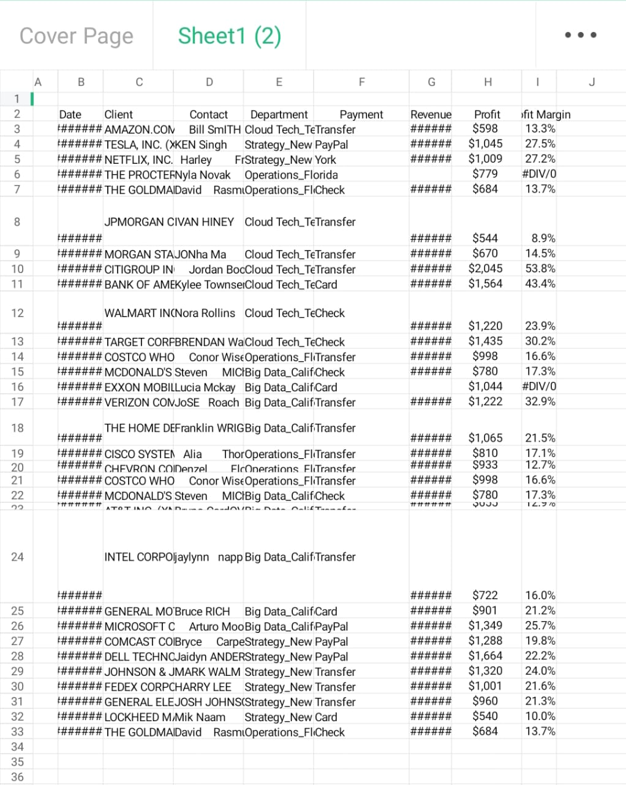

# Client Revenue Excel Cleaning Project

🧼 A real-world Excel-based data cleaning project to:
- Fix inconsistent formatting
- Correct value and profit margin errors
- Ensure numeric accuracy for analysis

---

## 📂 Files Included

| File Name | Description |
|-----------|-------------|
| `raw_dataset.xlsx` | Uncleaned original Excel file |
| `cleaned_dataset.xlsx` | Cleaned and formatted Excel version |
| `before_cleaning.jpg` | Screenshot of messy data |
| `after_cleaning.jpg` | Screenshot of cleaned data |

---

## 📊 Cleaning Performed

- Removed extra symbols and inconsistent currency formatting
- Ensured profit margins were calculated properly
- Aligned columns and renamed headers
- Applied data filters and sorting

---

## 📸 Before vs After

### 🔴 Before Cleaning

### ✅ After Cleaning

---

## 🛠 Tools Used
- Microsoft Excel
- Manual data cleaning techniques (no-code)

